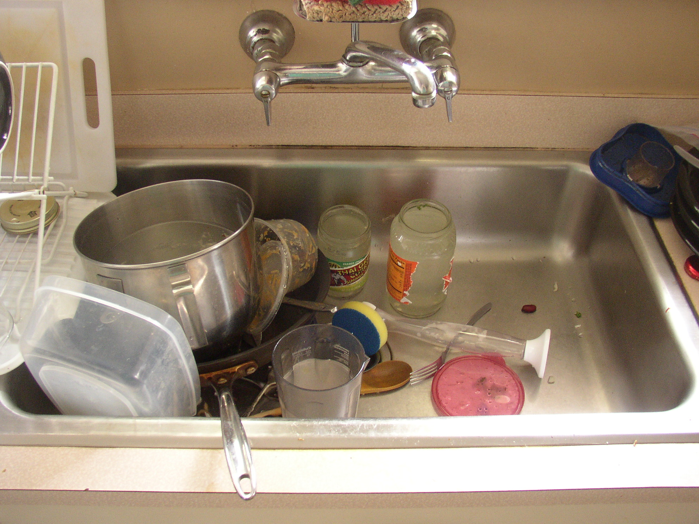

```{r setup, include=FALSE}
options(htmltools.dir.version = FALSE)

footer_spacing <- function(left_spaces = 20, 
                           right_spaces = 8,
                           center_title = "Effective use of Shiny Modules",
                           left_title = "bit.ly/modules2019",
                           right_title = "rstudio::conf 2019", 
                           footer_class = "my-footer") {
  footer_content <- paste0(left_title, paste(rep("&emsp", left_spaces), collapse=";"), ";", center_title, paste(rep("&emsp", right_spaces), collapse=";"),  ";", right_title)
  glue::glue('<div class="{footer_class}"><span>{footer_content}</span></div>')
}

r_logo <- function(colour = "#384CB7") {
  icon::fa_r_project(colour = colour)
}
```

layout: true

`r footer_spacing(left_spaces = 30, right_spaces = 24)` 

---

# My Journey with Shiny

.pull-left[
Early adopter when Shiny was released to CRAN

__First efforts__: Small prototypes to showcase possibilities and [learn by doing](https://r-podcast.org/15)

`r icon::fa("rocket", size = 1)` Ascend Joe Cheng's [ladder of enlightment](https://github.com/rstudio/ShinyDeveloperConference/blob/45737f1f3386fb3a9194c40f9a999b58f60971de/Reactivity/slides.Rmd#L233-L240) 

Present day: Developer of __large and complex__ applications integrating multiple systems
]

.pull-right[

]

---

# Case Study

Empower statisticians with little/no `r r_logo()` experience to perform subgroup identification based on [TSDT](https://cran.rstudio.com/web/packages/TSDT/) package

`r emo::ji("construction")` Non-trivial requirements (persistent sessions, dynamic UI, HPC integration)

--

__Difficulties__

* Duplicated similar(ish) UI widgets across app
* Code not organized well
* Extending capabilities was challenging

--

## What can solve many of these issues?

---
name: non-modules
background-image: url(img/non_modules_slides.svg)
background-position: center
background-size: contain

class: top, clear, center

---

background-image: url(img/spaghetti.jpg)
background-position: center
background-size: contain

class: inverse, clear, center, bottom

.center[
## [Reactive Spaghetti (Ian Lyttle & Alex Shum)](https://www.rstudio.com/resources/videos/shiny-modules/)
]

---
template: non-modules

.center[
.large[
What can solve many of these issues?
]
]

---

background-image: url(img/key.gif)
background-size: cover

class: inverse, clear, center, middle

# Modules to the Rescue!

---

# What are Modules?

--

## Compose complex apps into smaller, more understandable pieces

--

- Avoid namespace collisions when using same widget across different parts of your app
- Allows you to encapsulate distinct app components
- Organize code into logical and easy-to-understand components
- Facilitates collaboration

--

## Sound familiar?

--

- `r r_logo()` functions also help avoid collisions in variable names with general R code
- Essential for creating non-trivial and extensive workflows

---

background-image: url(img/modules_slide.svg)
background-position: center
background-size: contain

class: inverse, clear, center, middle

---

background-image: url(img/roadsunset17.png)
background-size: cover

class: inverse, clear, center, top

.center[
## Road to Modules Mastery
]

--

<div class="step1">(1) Creating/using simple modules occassionally</div>
--

<div class="step2">(2) Communication with modules</div>
<div class="step3">(3) Communication between sibling modules</div>

---

# All roads lead to these principles:

--
.pull-left[
.center[
## Careful design

What does the module do?

What is it trying to accomplish?

`r emo::ji("thinking")` What should I call this module?

]
]

--
.pull-right[
.center[
## Inputs & return values

Static or reactive input(s)?

Complexity of return values 

Which outputs serve as inputs for other modules?
]
]

--

.center[
## Effective Shiny app design

__Using modules without these principles in mind is not enough!__
]

---
background-image: url(img/ames_explorer_arrows_screenshot.svg)
background-position: center
background-size: contain

class: clear, center, bottom

# Example: Ames Housing Explorer

[rpodcast.shinyapps.io/ames_explorer](https://rpodcast.shinyapps.io/ames_explorer)

???

__TODO__: Ask about swapping for animated gif (was a resource hog when interactively viewing slides)

* Side-by-side scatterplots with variable choices
* Select points via Shiny's interactive [plot brushing](http://shiny.rstudio.com/articles/selecting-rows-of-data.html)
* View additional variables inside a [DT](https://rstudio.github.io/DT/) data table
* Ability to annotate total sales price for data points in table

---

# Document your modules!

.left-column-big[
```{r, tidy=FALSE, eval=FALSE}
#' Variable selection module server-side processing
#'
#' @param input, output, session standard \code{shiny} boilerplate #<<
#'
#' @return list with following components #<<
#' \describe{
#'   \item{xvar}{reactive character string indicating x variable selection}
#'   \item{yvar}{reactive character string indicating y variable selection}
#' }
varselect_mod_server <- function(input, output, session) {

  return( #<<
    list( #<<
      xvar = reactive({ input$xvar }), #<<
      yvar = reactive({ input$yvar }) #<<
    ) #<<
  ) #<<
}
```
]

.right-column-small[

`r emo::ji("spiral_notepad")` Document a module's input(s) and return value(s)

`r emo::ji("memo")` Constructing a named list articulates the __intent__ of a module


]

---

# Static or reactive inputs?

.left-column-big[
.code50[
```{r, tidy=FALSE, eval=FALSE}
#' Scatterplot module server-side processing
#'
#' This module produces a scatterplot with the sales price against a variable selected by the user.
#' 
#' @param input,output,session standard \code{shiny} boilerplate
#' @param dataset data frame (non-reactive) with variables necessary for scatterplot #<<
#' @param plot1_vars list containing reactive x-variable name (called `xvar`) and y-variable name (called `yvar`) for plot 1 
#' @param plot2_vars list containing reactive x-variable name (called `xvar`) and y-variable name (called `yvar`) for plot 2 
scatterplot_server_mod <- function(input, 
                                   output, 
                                   session, 
                                   dataset, 
                                   plot1vars,
                                   plot2vars) {
  
  
  plot1_obj <- reactive({
    p <- scatter_sales(dataset, xvar = plot1vars$xvar(), yvar = plot1vars$yvar()) #<<
    return(p)
  })
  
  plot2_obj <- reactive({
    p <- scatter_sales(dataset, xvar = plot2vars$xvar(), yvar = plot2vars$yvar()) #<<
    return(p)
  })
  
  output$plot1 <- renderPlot({
    plot1_obj()
  })
  
  output$plot2 <- renderPlot({
    plot2_obj()
  })
}
```
]
]

.right-column-small[
Why `dataset` and not `dataset()`?

* `dataset` does not change within the application
* Only need the __present__ value

]

---

# Present or future value?

.left-column-big[
.code50[
```{r, tidy=FALSE, eval=FALSE}
#' Scatterplot module server-side processing
#'
#' This module produces a scatterplot with the sales price against a variable selected by the user.
#' 
#' @param input,output,session standard \code{shiny} boilerplate
#' @param dataset data frame (non-reactive) with variables necessary for scatterplot
#' @param plot1_vars list containing reactive x-variable name (called `xvar`) and y-variable name (called `yvar`) for plot 1 #<<
#' @param plot2_vars list containing reactive x-variable name (called `xvar`) and y-variable name (called `yvar`) for plot 2 #<<
scatterplot_server_mod <- function(input, 
                                   output, 
                                   session, 
                                   dataset, 
                                   plot1vars,
                                   plot2vars) {
  
  
  plot1_obj <- reactive({
    p <- scatter_sales(dataset, xvar = plot1vars$xvar(), yvar = plot1vars$yvar()) #<<
    return(p)
  })
  
  plot2_obj <- reactive({
    p <- scatter_sales(dataset, xvar = plot2vars$xvar(), yvar = plot2vars$yvar()) #<<
    return(p)
  })
  
  output$plot1 <- renderPlot({
    plot1_obj()
  })
  
  output$plot2 <- renderPlot({
    plot2_obj()
  })
}
```
]
]

.right-column-small[
`xvar` and `yvar`: __Reactive__ based on variable chooser

Not just the __present__ value, but the __future__ value too

How to correctly reference these inputs?

`r emo::ji("x")` `plot1vars()$yvar`

`r emo::ji("white_check_mark")` `plot1vars$yvar()`
]

---

# Traps to avoid

.pull-left[
.center[

]

.code70[
```{r, eval=FALSE}
# in main app, set up placeholder
r_data <- reactiveValues()

# pass r_data around as input parameter in all modules
module1_mod <- function(input, output, session, r_data) {
  
  obj1 <- reactive({
    # various processing ...
    foo <- complicated_function()
    r_data[['obj1']] <- foo
  })
  
  # Return something? Nah, I took care of that already!
}

# imagine many other modules as above ...
callModule(module1_mod, "id1", r_data)
callModule(module2_mod, "id2", r_data)
```
]
]

--

.pull-right[
## What could possibly go wrong?

* __Hidden State__: Difficult to pinpoint which module(s) impact `r_data` objects
* Only certain objects from `r_data` are needed in a given module
* Lose sight of the __contracts__ between modules

__Perspective__: Passing environments back and forth between typical `r r_logo()` functions would be a bad idea too!
]


---
background-image: url(https://media.giphy.com/media/l41YBHH1A6OPQ5iXS/giphy.gif)
background-size: cover
class: inverse, clear, center, middle

---

# You may already know...

* `r r_logo()` is well-suited for interactive workflows in data science
* Functions become an essential building-block when moving from prototypes to non-trivial workflows
* Define clear function inputs and return values for effective structure

--

## Is it any different when creating Shiny apps?  No!

Using modules combined with the principles discussed today is __essential__ to bring software engineering best practices to application development

* Determine purpose of the module
* Documentation for inputs and outputs 
* Define the relationships between modules

---

# Calls to action

Read the new article on [module communication best practices](http://shiny.rstudio.com/articles/communicate-bet-modules.html) at the Shiny site

`r emo::ji("eyes")` for more articles this year on additional module topics

Review [Ames Housing Explorer app](https://rpodcast.shinyapps.io/ames_explorer) that demonstrates the principles discussed today and more.  Code available __TODO: Insert Link__

---

# Thank you!

.center[
<table style="border-style:none;padding-top:30px;" class=".table">
  <br />
  <br />
  <tr>
    <th style="padding-right:25px!important" align="center"><a href="https://twitter.com/thercast"> <i class="fab fa-twitter fa-3x"></i> </a></th>
    <th style="padding-left:25px!important" align="center"><a href="https://github.com/rpodcast"> <i class="fab fa-github fa-3x"></i> </a></th>
    <th style="padding-left:25px!important" align="center"><a href="https://gitlab.com/rpodcast"> <i class="fab fa-gitlab fa-3x"></i> </a></th>
    <th style="padding-left:25px!important" align="center"><a href="https://r-podcast.org"> <i class="fa fa-microphone fa-3x"></i> </a></th>
  </tr>
  <tr style="background-color:#fafafa">
    <th style="padding-right:25px!important"><a href="https://twitter.com/thercast"> @thercast </a></th>
    <th style="padding-left:25px!important"><a href="https://github.com/rpodcast"> @rpodcast </a></th>
    <th style="padding-left:25px!important"><a href="https://gitlab.com/rpodcast"> @rpodcast </a></th>
    <th style="padding-left:25px!important"><a href="https://r-podcast.org"> r-podcast.org </a></th>
  </tr></table>
]

.font110[
Other efforts in the `r r_logo()` community:
* Contributor to [R Weekly](https://rweekly.org/)
* [RStudio Community](https://community.rstudio.com/) sustainer
* Member of [Rbind](https://support.rbind.io/) administrator team

Slides created with the [xaringan](https://slides.yihui.name/xaringan) package available at [bit.ly/modules2019](https://bit.ly/modules2019)
]
