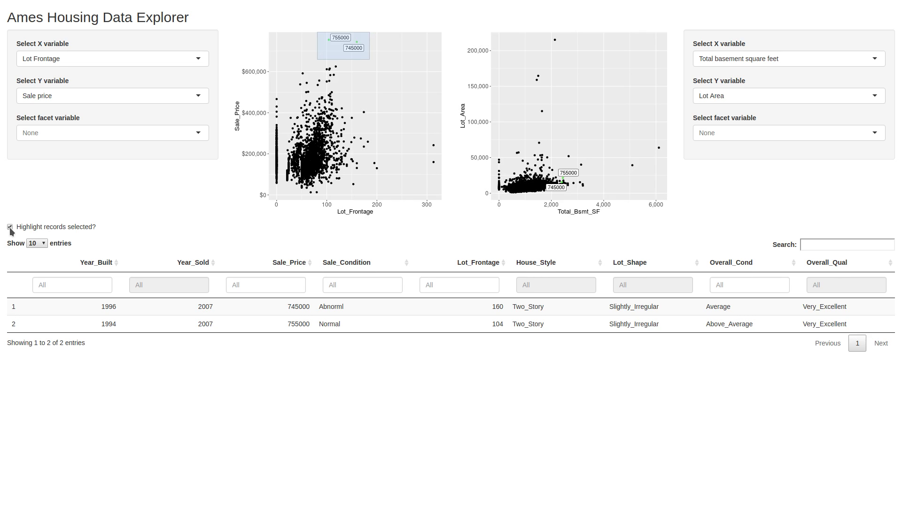

```{r setup, include=FALSE}
options(htmltools.dir.version = FALSE)

footer_spacing <- function(left_spaces = 20, 
                           right_spaces = 8,
                           center_title = "Effective use of Shiny Modules",
                           left_title = "bit.ly/modules2019",
                           right_title = "rstudio::conf 2019", 
                           footer_class = "my-footer") {
  footer_content <- paste0(left_title, paste(rep("&emsp", left_spaces), collapse=";"), ";", center_title, paste(rep("&emsp", right_spaces), collapse=";"),  ";", right_title)
  glue::glue('<div class="{footer_class}"><span>{footer_content}</span></div>')
}

r_logo <- function(colour = "#384CB7") {
  icon::fa_r_project(colour = colour)
}
```

layout: true

`r footer_spacing(left_spaces = 30, right_spaces = 24)` 

---

# My Journey with Shiny

.pull-left[
Early adopter when Shiny was released to CRAN

__First efforts__: Small prototypes to showcase possibilities and [learn by doing](https://r-podcast.org/15)

`r icon::fa("rocket", size = 1)` Ascend Joe Cheng's [ladder of enlightment](https://github.com/rstudio/ShinyDeveloperConference/blob/45737f1f3386fb3a9194c40f9a999b58f60971de/Reactivity/slides.Rmd#L233-L240) 

Present day: Developer of __large and complex__ applications integrating multiple systems
]

.pull-right[

]

---

# Case Study

Empower statisticians with little/no `r r_logo()` experience to perform subgroup identification based on [TSDT](https://cran.rstudio.com/web/packages/TSDT/) package

`r emo::ji("construction")` Non-trivial requirements (persistent sessions, dynamic UI, HPC integration)

--

__Difficulties__

* Duplicated similar(ish) UI widgets across app
* Code not organized well
* Extending capabilities was challenging

--

## What can solve many of these issues?

---

background-image: url(img/key.gif)
background-size: cover

class: inverse, clear, center, middle

# Modules to the Rescue!

---

# What are Modules?

--

## Functions optimized for Shiny applications

--

- Avoid namespace collisions when using same widget across different parts of your app
- Allows you to encapsulate distinct app components
- Organize code into logical and easy-to-understand components
- Facilitates collaboration

--

## Sound familiar?

--

- `r r_logo()` functions help avoid collisions in variable names with general R code
- Essential for creating non-trivial and extensive workflows

---

background-image: url(img/roadsunset17.png)
background-size: cover

class: inverse, clear, center, top

.center[
## Road to Modules Mastery
]

--

<div class="step1">(1) Creating/using simple modules occassionally</div>
--

<div class="step2">(2) Communication with modules</div>
<div class="step3">(3) Communication between sibling modules</div>

---

# Example: Ames Housing Explorer



[rpodcast.shinyapps.io/ames_explorer](https://rpodcast.shinyapps.io/ames_explorer)

???

__TODO__: Ask about swapping for animated gif (was a resource hog when interactively viewing slides)

* Side-by-side scatterplots with variable choices
* Select points via Shiny's interactive [plot brushing](http://shiny.rstudio.com/articles/selecting-rows-of-data.html)
* View additional variables inside a [DT](https://rstudio.github.io/DT/) data table
* Ability to annotate total sales price for data points in table

---

# Variable Selection

.left-column-big[
```{r, tidy=FALSE, eval=FALSE}
#' Variable selection module server-side processing
#'
#' @param input, output, session standard \code{shiny} boilerplate #<<
#'
#' @return list with following components #<<
#' \describe{
#'   \item{xvar}{reactive character string indicating x variable selection}
#'   \item{yvar}{reactive character string indicating y variable selection}
#' }
varselect_mod_server <- function(input, output, session) {

  return( #<<
    list( #<<
      xvar = reactive({ input$xvar }), #<<
      yvar = reactive({ input$yvar }) #<<
    ) #<<
  ) #<<
}
```
]

.right-column-small[

`r emo::ji("spiral_notepad")` Document a module's input(s) and return value(s)

Constructing a named list articulates the __intent__ of a module
]

---

# Scatterplot Module

.left-column-big[
.code50[
```{r, tidy=FALSE, eval=FALSE}
#' Scatterplot module server-side processing
#'
#' This module produces a scatterplot with the sales price against a variable selected by the user.
#' 
#' @param input,output,session standard \code{shiny} boilerplate
#' @param dataset data frame (non-reactive) with variables necessary for scatterplot
#' @param plot1_vars list containing reactive x-variable name (called `xvar`) and y-variable name (called `yvar`) for plot 1 #<<
#' @param plot2_vars list containing reactive x-variable name (called `xvar`) and y-variable name (called `yvar`) for plot 2 #<<
scatterplot_server_mod <- function(input, 
                            output, 
                            session, 
                            dataset, 
                            plot1vars,
                            plot2vars) {
  
  
  plot1_obj <- reactive({
    p <- scatter_sales(dataset, xvar = plot1vars$xvar(), yvar = plot1vars$yvar()) #<<
    return(p)
  })
  
  plot2_obj <- reactive({
    p <- scatter_sales(dataset, xvar = plot2vars$xvar(), yvar = plot2vars$yvar()) #<<
    return(p)
  })
  
  output$plot1 <- renderPlot({
    plot1_obj()
  })
  
  output$plot2 <- renderPlot({
    plot2_obj()
  })
}
```
]
]

.right-column-small[
Clearly-defined object types for `plot1vars` and `plot2vars` inputs

How to correctly reference these inputs?

`r emo::ji("x")` `plot1vars()$yvar`

`r emo::ji("white_check_mark")` `plot1vars$yvar()`
]

---

class: inverse, clear, center, middle

# What does it all mean?

---

# You may already know...

* `r r_logo()` is well-suited for interactive workflows in data science

* Functions become an essential building-block when moving from prototypes to non-trivial workflows

--

## Is it any different when creating Shiny apps?  No!

* Shiny modules are __essential__ to bring software engineering best practices to application development

---

# Call to action

* Read the new article on module communication best practices at the Shiny site
* Watch for more articles this year on additional module topics
* Review Ames Housing Explorer app that demonstrates many of these concepts


---
class: fullscreen, inverse, center, text-black

.font250[**Backup**]

---


---

# What is a module?


---

# Why should we care?


---

# Learning Modules

- I started using modules in basic ways (apps with maybe 1-2 modules reused in different parts)
- More for display and having convenient UI widgets
- Over time: Complex applications with many modules (20 plus)
    + Forced to think carefully about orchestration & how to reliably link (compose) modules together
    + (pic of music conductor? maybe too corny)

---

# Roadmap for using modules in complex apps

1. Creating and using simple modules occassionally
2. Communication with modules (receiving input and returning output)
3. Communication between sibling modules (parent in charge) (this is more of 2 above)
4. (May not include0) Modules that use other modules as inputs / parameters


---

# Basic Example

Use modules from first article (variable chooser and scatterplot)
* Only one plot for simplicity
* Variable select: Demonstrates simple UI (two select inputs)
* Plot module: Demonstrates displaying output based on input parameters

__Key Points__
* Be explicit about the __contract__ for a module
* Document the inputs and return values much like an R function

